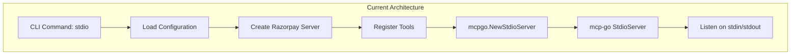
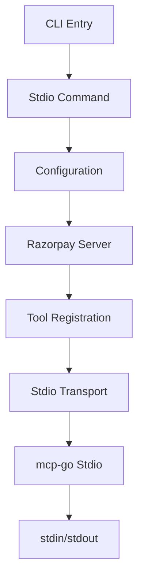
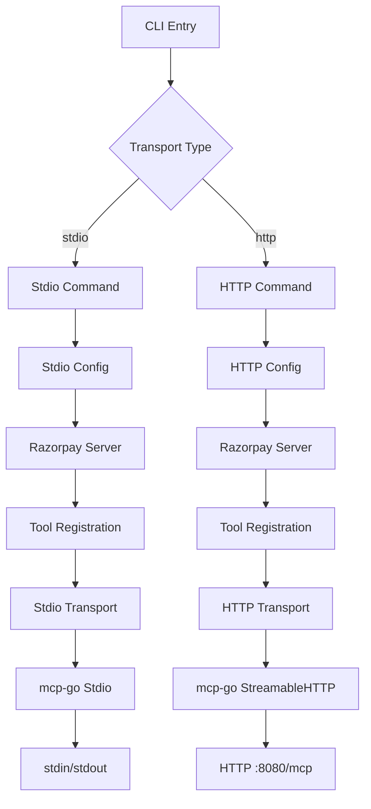
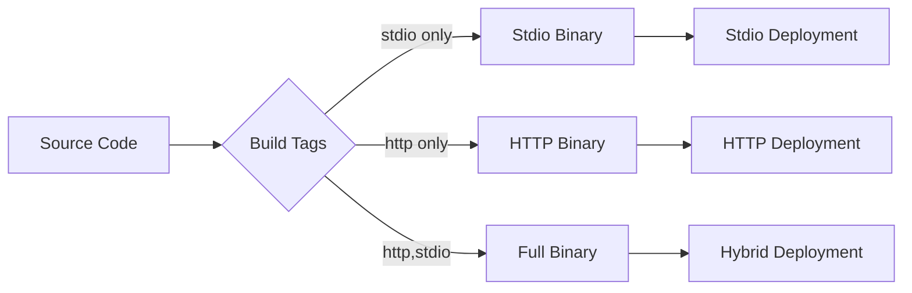

# Migration Guide: Stdio to HTTP Transport for Razorpay MCP Server

## Executive Summary

This guide provides a comprehensive migration path from the current stdio-only transport to HTTP transport in the Razorpay MCP Server. The migration leverages the existing mcp-go library's robust HTTP transport implementation (StreamableHTTP) while maintaining backward compatibility and using build tags for feature management.

## Why HTTP Transport?

### Current Limitations with Stdio
- **Single Client**: Stdio transport supports only one client connection
- **Container Dependency**: HTTP access requires Docker containers
- **Limited Integration**: No direct web service integration
- **Deployment Constraints**: Not suitable for web applications or API gateways

### Benefits of HTTP Transport
- **Multiple Clients**: Concurrent client support with session management
- **Web Integration**: Direct HTTP/REST API access
- **Scalability**: Better performance for high-throughput scenarios
- **Cloud Native**: Native support for containerized and serverless deployments
- **Standard Protocol**: Familiar HTTP semantics for debugging and monitoring

### Use Cases Enabled
- **Web Applications**: Direct integration with frontend applications
- **API Gateways**: Proxy through standard HTTP infrastructure
- **Load Balancing**: Distribute requests across multiple server instances
- **Monitoring**: Standard HTTP metrics and health checks
- **Authentication**: HTTP-based auth mechanisms (OAuth, JWT, API keys)

## Current Stdio Code Layout

### Key Files and Structure

```
cmd/razorpay-mcp-server/
├── main.go           # CLI setup, only stdio command registered
├── stdio.go          # Stdio transport implementation
├── http.go           # Empty placeholder file
└── http_test.go      # Empty placeholder file

pkg/mcpgo/
├── server.go         # Server abstraction over mcp-go
├── stdio.go          # Stdio transport wrapper
├── transport.go      # Transport interface definition
└── tool.go           # Tool abstraction
```

### Current Stdio Flow



## mcp-go HTTP Transport Patterns

### mcp-go StreamableHTTP Implementation

The mcp-go library provides excellent HTTP transport through `StreamableHTTPServer`:

```go
// Server creation pattern from mcp-go
server := server.NewMCPServer("name", "version", opts...)
httpServer := server.NewStreamableHTTPServer(server, 
    server.WithEndpointPath("/mcp"),
    server.WithLogger(logger),
)

// Start HTTP server
err := httpServer.Start(":8080")
```

### Key mcp-go HTTP Features

1. **Dual Response Mode**: JSON responses or SSE streams
2. **Session Management**: Built-in session handling with IDs
3. **Stateless/Stateful**: Configurable session management
4. **Standard HTTP**: POST for requests, GET for notifications
5. **Error Handling**: Proper HTTP status codes and JSON-RPC errors

### Transport Patterns from mcp-go Examples

```go
// From mcp-go/examples/everything/main.go
func main() {
    var transport string
    flag.StringVar(&transport, "t", "stdio", "Transport type (stdio or http)")
    
    mcpServer := NewMCPServer()
    
    if transport == "http" {
        httpServer := server.NewStreamableHTTPServer(mcpServer)
        log.Printf("HTTP server listening on :8080/mcp")
        if err := httpServer.Start(":8080"); err != nil {
            log.Fatalf("Server error: %v", err)
        }
    } else {
        if err := server.ServeStdio(mcpServer); err != nil {
            log.Fatalf("Server error: %v", err)
        }
    }
}
```

## Step-by-Step Migration with Build Tags

### Phase 1: Infrastructure Setup

#### 1.1 Add Build Tags Structure

Create build tag strategy for gradual rollout:

```go
// +build http

// cmd/razorpay-mcp-server/http.go
```

```go
// +build !http

// cmd/razorpay-mcp-server/stdio_only.go  
```

#### 1.2 Implement HTTP Transport Abstraction

**File: `pkg/mcpgo/http.go`**
```go
package mcpgo

import (
    "context"
    "fmt"
    "io"
    "net/http"
    
    "github.com/mark3labs/mcp-go/server"
)

// HTTPServerOptions configures HTTP transport
type HTTPServerOptions struct {
    Address      string
    EndpointPath string
    Logger       Logger
    Stateless    bool
}

// HTTPTransportServer implements HTTP transport
type HTTPTransportServer struct {
    mcpHTTPServer *server.StreamableHTTPServer
    httpServer    *http.Server
}

// NewHTTPServer creates HTTP transport server
func NewHTTPServer(mcpServer Server, opts HTTPServerOptions) (*HTTPTransportServer, error) {
    sImpl, ok := mcpServer.(*mark3labsImpl)
    if !ok {
        return nil, fmt.Errorf("%w: expected *mark3labsImpl, got %T",
            ErrInvalidServerImplementation, mcpServer)
    }

    var serverOpts []server.StreamableHTTPOption
    if opts.EndpointPath != "" {
        serverOpts = append(serverOpts, server.WithEndpointPath(opts.EndpointPath))
    }
    if opts.Stateless {
        serverOpts = append(serverOpts, server.WithStateLess(true))
    }
    if opts.Logger != nil {
        serverOpts = append(serverOpts, server.WithLogger(opts.Logger))
    }

    httpServer := server.NewStreamableHTTPServer(sImpl.mcpServer, serverOpts...)
    
    return &HTTPTransportServer{
        mcpHTTPServer: httpServer,
    }, nil
}

// Start begins HTTP server
func (h *HTTPTransportServer) Start(address string) error {
    return h.mcpHTTPServer.Start(address)
}

// Shutdown gracefully stops the server
func (h *HTTPTransportServer) Shutdown(ctx context.Context) error {
    return h.mcpHTTPServer.Shutdown(ctx)
}

// ServeHTTP implements http.Handler for custom routing
func (h *HTTPTransportServer) ServeHTTP(w http.ResponseWriter, r *http.Request) {
    h.mcpHTTPServer.ServeHTTP(w, r)
}
```

### Phase 2: HTTP Command Implementation

#### 2.1 HTTP Command Structure

**File: `cmd/razorpay-mcp-server/http.go`**
```go
// +build http

package main

import (
    "context"
    "fmt"
    "log/slog"
    "net/http"
    "os"
    "os/signal"
    "syscall"
    "time"

    "github.com/spf13/cobra"
    "github.com/spf13/viper"
    
    rzpsdk "github.com/razorpay/razorpay-go"
    "github.com/razorpay/razorpay-mcp-server/pkg/log"
    "github.com/razorpay/razorpay-mcp-server/pkg/mcpgo"
    "github.com/razorpay/razorpay-mcp-server/pkg/razorpay"
)

// httpCmd starts the mcp server in HTTP transport mode
var httpCmd = &cobra.Command{
    Use:   "http",
    Short: "start the HTTP server",
    Run: func(cmd *cobra.Command, args []string) {
        // Get HTTP-specific flags
        address := viper.GetString("address")
        endpoint := viper.GetString("endpoint")
        stateless := viper.GetBool("stateless")
        
        // Common setup (same as stdio)
        logPath := viper.GetString("log_file")
        log, close, err := log.New(logPath)
        if err != nil {
            stdlog.Fatalf("create logger: %v", err)
        }
        defer close()

        key := viper.GetString("key")
        secret := viper.GetString("secret")
        client := rzpsdk.NewClient(key, secret)
        client.SetUserAgent("razorpay-mcp/" + version + "/http")

        enabledToolsets := viper.GetStringSlice("toolsets")
        readOnly := viper.GetBool("read_only")

        err = runHTTPServer(log, client, enabledToolsets, readOnly, HTTPConfig{
            Address:   address,
            Endpoint:  endpoint,
            Stateless: stateless,
        })
        if err != nil {
            log.Error("error running HTTP server", "error", err)
            stdlog.Fatalf("failed to run HTTP server: %v", err)
        }
    },
}

type HTTPConfig struct {
    Address   string
    Endpoint  string
    Stateless bool
}

func init() {
    // Add HTTP-specific flags
    httpCmd.Flags().StringP("address", "a", ":8080", "HTTP server address")
    httpCmd.Flags().StringP("endpoint", "e", "/mcp", "HTTP endpoint path")
    httpCmd.Flags().Bool("stateless", false, "run in stateless mode")
    
    // Bind flags to viper
    _ = viper.BindPFlag("address", httpCmd.Flags().Lookup("address"))
    _ = viper.BindPFlag("endpoint", httpCmd.Flags().Lookup("endpoint"))
    _ = viper.BindPFlag("stateless", httpCmd.Flags().Lookup("stateless"))
    
    // Set environment variable mappings
    _ = viper.BindEnv("address", "RAZORPAY_MCP_ADDRESS")
    _ = viper.BindEnv("endpoint", "RAZORPAY_MCP_ENDPOINT")
    _ = viper.BindEnv("stateless", "RAZORPAY_MCP_STATELESS")
    
    // Register command
    rootCmd.AddCommand(httpCmd)
}

func runHTTPServer(
    log *slog.Logger,
    client *rzpsdk.Client,
    enabledToolsets []string,
    readOnly bool,
    config HTTPConfig,
) error {
    ctx, stop := signal.NotifyContext(
        context.Background(),
        os.Interrupt,
        syscall.SIGTERM,
    )
    defer stop()

    // Create Razorpay server (same as stdio)
    srv, err := razorpay.NewServer(log, client, version, enabledToolsets, readOnly)
    if err != nil {
        return fmt.Errorf("failed to create server: %w", err)
    }
    srv.RegisterTools()

    // Create HTTP transport server
    httpSrv, err := mcpgo.NewHTTPServer(srv.GetMCPServer(), mcpgo.HTTPServerOptions{
        Address:      config.Address,
        EndpointPath: config.Endpoint,
        Stateless:    config.Stateless,
    })
    if err != nil {
        return fmt.Errorf("failed to create HTTP server: %w", err)
    }

    // Start server in goroutine
    errC := make(chan error, 1)
    go func() {
        log.Info("starting HTTP server", "address", config.Address, "endpoint", config.Endpoint)
        errC <- httpSrv.Start(config.Address)
    }()

    _, _ = fmt.Fprintf(os.Stderr, "Razorpay MCP Server running on HTTP %s%s\n", 
        config.Address, config.Endpoint)

    // Wait for shutdown signal or error
    select {
    case <-ctx.Done():
        log.Info("shutting down HTTP server...")
        shutdownCtx, cancel := context.WithTimeout(context.Background(), 30*time.Second)
        defer cancel()
        return httpSrv.Shutdown(shutdownCtx)
    case err := <-errC:
        if err != nil && err != http.ErrServerClosed {
            log.Error("HTTP server error", "error", err)
            return err
        }
        return nil
    }
}
```

#### 2.2 Stdio-Only Fallback

**File: `cmd/razorpay-mcp-server/stdio_only.go`**
```go
// +build !http

package main

import (
    "github.com/spf13/cobra"
)

func init() {
    // When HTTP build tag is not set, don't register HTTP command
    // This ensures backward compatibility
}
```

### Phase 3: Build Configuration

#### 3.1 Makefile Updates

**File: `Makefile`**
```makefile
.PHONY: build build-stdio build-http build-full test

# Default build (stdio only)
build: build-stdio

# Build stdio-only version
build-stdio:
	go build -tags=stdio -o bin/razorpay-mcp-server ./cmd/razorpay-mcp-server

# Build HTTP-enabled version  
build-http:
	go build -tags=http -o bin/razorpay-mcp-server-http ./cmd/razorpay-mcp-server

# Build with both transports
build-full:
	go build -tags=http,stdio -o bin/razorpay-mcp-server-full ./cmd/razorpay-mcp-server

# Test with different build configurations
test-stdio:
	go test -tags=stdio ./...

test-http:
	go test -tags=http ./...

test-all:
	go test -tags=http,stdio ./...
```

#### 3.2 Docker Multi-Stage Build

**File: `Dockerfile`**
```dockerfile
FROM golang:1.24.2-alpine AS builder

WORKDIR /app
COPY go.mod go.sum ./
RUN go mod download

COPY . .

ARG VERSION="dev"
ARG BUILD_TAGS="http,stdio"

# Build with specified tags
RUN CGO_ENABLED=0 GOOS=linux go build \
    -tags=${BUILD_TAGS} \
    -ldflags "-X main.version=${VERSION} -X main.commit=$(git rev-parse HEAD) -X main.date=$(date -u +%Y-%m-%dT%H:%M:%SZ)" \
    -o razorpay-mcp-server ./cmd/razorpay-mcp-server

FROM alpine:latest

RUN apk --no-cache add ca-certificates
RUN addgroup -S rzpgroup && adduser -S rzp -G rzpgroup

WORKDIR /app
COPY --from=builder /app/razorpay-mcp-server .
RUN chown -R rzp:rzpgroup /app

ENV CONFIG="" \
    RAZORPAY_KEY_ID="" \
    RAZORPAY_KEY_SECRET="" \
    LOG_FILE="" \
    RAZORPAY_MCP_ADDRESS=":8080" \
    RAZORPAY_MCP_ENDPOINT="/mcp"

USER rzp

# Default to stdio for backward compatibility
ENTRYPOINT ["sh", "-c", "./razorpay-mcp-server ${TRANSPORT:-stdio} --key ${RAZORPAY_KEY_ID} --secret ${RAZORPAY_KEY_SECRET} ${CONFIG:+--config ${CONFIG}} ${LOG_FILE:+--log-file ${LOG_FILE}} ${TRANSPORT:+${RAZORPAY_MCP_ADDRESS:+--address ${RAZORPAY_MCP_ADDRESS}}} ${TRANSPORT:+${RAZORPAY_MCP_ENDPOINT:+--endpoint ${RAZORPAY_MCP_ENDPOINT}}}"]
```

## Before/After Code Comparison

### Before: Stdio Only

```go
// cmd/razorpay-mcp-server/main.go
func init() {
    rootCmd.AddCommand(stdioCmd)  // Only stdio
}

// cmd/razorpay-mcp-server/stdio.go  
func runStdioServer(...) error {
    stdioSrv, err := mcpgo.NewStdioServer(srv.GetMCPServer())
    return stdioSrv.Listen(ctx, os.Stdin, os.Stdout)
}
```

### After: Multi-Transport

```go
// cmd/razorpay-mcp-server/main.go
func init() {
    rootCmd.AddCommand(stdioCmd)
    // HTTP command registered conditionally via build tags
}

// cmd/razorpay-mcp-server/http.go (with build tag)
func runHTTPServer(...) error {
    httpSrv, err := mcpgo.NewHTTPServer(srv.GetMCPServer(), opts)
    return httpSrv.Start(":8080")
}
```

## Migration Architecture Diagrams

### Current Architecture



### Target Architecture



### Build Tag Strategy



## Testing Strategy

### Unit Tests

#### 3.1 HTTP Transport Tests

**File: `cmd/razorpay-mcp-server/http_test.go`**
```go
// +build http

package main

import (
    "context"
    "encoding/json"
    "net/http"
    "testing"
    "time"
    
    "github.com/stretchr/testify/assert"
    "github.com/stretchr/testify/require"
)

func TestHTTPServer(t *testing.T) {
    t.Run("starts and responds to initialize", func(t *testing.T) {
        // Setup test server
        srv := setupTestHTTPServer(t)
        defer srv.Close()
        
        // Test initialize request
        initReq := map[string]interface{}{
            "jsonrpc": "2.0",
            "id":      1,
            "method":  "initialize",
            "params": map[string]interface{}{
                "protocolVersion": "2024-11-05",
                "clientInfo": map[string]interface{}{
                    "name": "test-client",
                    "version": "1.0.0",
                },
            },
        }
        
        resp := postJSON(t, srv.URL+"/mcp", initReq)
        assert.Equal(t, http.StatusOK, resp.StatusCode)
        
        var response map[string]interface{}
        err := json.NewDecoder(resp.Body).Decode(&response)
        require.NoError(t, err)
        
        assert.Equal(t, "2.0", response["jsonrpc"])
        assert.Equal(t, float64(1), response["id"])
        assert.NotNil(t, response["result"])
    })
    
    t.Run("handles tool calls", func(t *testing.T) {
        // Test tool execution
    })
    
    t.Run("supports concurrent clients", func(t *testing.T) {
        // Test multiple simultaneous connections
    })
}

func setupTestHTTPServer(t *testing.T) *httptest.Server {
    // Create test server setup
}
```

#### 3.2 Integration Tests

**File: `pkg/mcpgo/http_test.go`**
```go
package mcpgo

import (
    "context"
    "testing"
    "time"
    
    "github.com/stretchr/testify/assert"
    "github.com/stretchr/testify/require"
)

func TestHTTPTransportIntegration(t *testing.T) {
    t.Run("server lifecycle", func(t *testing.T) {
        server := NewServer("test", "1.0.0")
        
        httpSrv, err := NewHTTPServer(server, HTTPServerOptions{
            Address:   ":0", // Random port
            Stateless: true,
        })
        require.NoError(t, err)
        
        // Test start
        go func() {
            err := httpSrv.Start(":0")
            assert.NoError(t, err)
        }()
        
        time.Sleep(100 * time.Millisecond)
        
        // Test shutdown
        ctx, cancel := context.WithTimeout(context.Background(), 5*time.Second)
        defer cancel()
        
        err = httpSrv.Shutdown(ctx)
        assert.NoError(t, err)
    })
}
```

### Load Testing

**File: `test/load/http_load_test.go`**
```go
package load

import (
    "testing"
    "time"
    
    vegeta "github.com/tsenart/vegeta/v12/lib"
)

func TestHTTPLoad(t *testing.T) {
    if testing.Short() {
        t.Skip("skipping load test in short mode")
    }
    
    rate := vegeta.Rate{Freq: 100, Per: time.Second}
    duration := 30 * time.Second
    targeter := vegeta.NewStaticTargeter(vegeta.Target{
        Method: "POST",
        URL:    "http://localhost:8080/mcp",
        Header: http.Header{
            "Content-Type": []string{"application/json"},
        },
        Body: []byte(`{
            "jsonrpc": "2.0",
            "id": 1,
            "method": "tools/list"
        }`),
    })
    
    attacker := vegeta.NewAttacker()
    
    var metrics vegeta.Metrics
    for res := range attacker.Attack(targeter, rate, duration, "HTTP Load Test") {
        metrics.Add(res)
    }
    metrics.Close()
    
    // Assertions on performance metrics
    assert.True(t, metrics.Success > 0.95)
    assert.True(t, metrics.Latencies.P99 < 100*time.Millisecond)
}
```

## Deployment Notes

### Environment Variables

#### New HTTP-specific Variables
```bash
# HTTP server configuration
RAZORPAY_MCP_ADDRESS=":8080"          # Server address
RAZORPAY_MCP_ENDPOINT="/mcp"          # Endpoint path
RAZORPAY_MCP_STATELESS="false"        # Session management
RAZORPAY_MCP_TIMEOUT="30s"            # Request timeout

# Existing variables (unchanged)
RAZORPAY_KEY_ID="your_key_id"
RAZORPAY_KEY_SECRET="your_secret"
LOG_FILE="/var/log/razorpay-mcp.log"
```

### Docker Compose Examples

#### 3.1 Stdio Only (Backward Compatible)
```yaml
# docker-compose.stdio.yml
version: '3.8'
services:
  razorpay-mcp:
    image: razorpay/mcp:latest
    environment:
      RAZORPAY_KEY_ID: "${RAZORPAY_KEY_ID}"
      RAZORPAY_KEY_SECRET: "${RAZORPAY_KEY_SECRET}"
      TRANSPORT: "stdio"
    stdin_open: true
    tty: true
```

#### 3.2 HTTP Transport
```yaml
# docker-compose.http.yml
version: '3.8'
services:
  razorpay-mcp:
    image: razorpay/mcp:latest
    environment:
      RAZORPAY_KEY_ID: "${RAZORPAY_KEY_ID}"
      RAZORPAY_KEY_SECRET: "${RAZORPAY_KEY_SECRET}"
      TRANSPORT: "http"
      RAZORPAY_MCP_ADDRESS: ":8080"
      RAZORPAY_MCP_ENDPOINT: "/mcp"
    ports:
      - "8080:8080"
    healthcheck:
      test: ["CMD", "wget", "--quiet", "--tries=1", "--spider", "http://localhost:8080/mcp"]
      interval: 30s
      timeout: 10s
      retries: 3
```

#### 3.3 Load Balanced HTTP
```yaml
# docker-compose.lb.yml
version: '3.8'
services:
  nginx:
    image: nginx:alpine
    ports:
      - "80:80"
    depends_on:
      - razorpay-mcp-1
      - razorpay-mcp-2
    volumes:
      - ./nginx.conf:/etc/nginx/nginx.conf
      
  razorpay-mcp-1:
    image: razorpay/mcp:latest
    environment:
      RAZORPAY_KEY_ID: "${RAZORPAY_KEY_ID}"
      RAZORPAY_KEY_SECRET: "${RAZORPAY_KEY_SECRET}"
      TRANSPORT: "http"
      RAZORPAY_MCP_STATELESS: "true"
    expose:
      - "8080"
      
  razorpay-mcp-2:
    image: razorpay/mcp:latest
    environment:
      RAZORPAY_KEY_ID: "${RAZORPAY_KEY_ID}"
      RAZORPAY_KEY_SECRET: "${RAZORPAY_KEY_SECRET}"
      TRANSPORT: "http"
      RAZORPAY_MCP_STATELESS: "true"
    expose:
      - "8080"
```

### Kubernetes Deployment

**File: `k8s/http-deployment.yaml`**
```yaml
apiVersion: apps/v1
kind: Deployment
metadata:
  name: razorpay-mcp-http
spec:
  replicas: 3
  selector:
    matchLabels:
      app: razorpay-mcp-http
  template:
    metadata:
      labels:
        app: razorpay-mcp-http
    spec:
      containers:
      - name: razorpay-mcp
        image: razorpay/mcp:latest
        env:
        - name: TRANSPORT
          value: "http"
        - name: RAZORPAY_KEY_ID
          valueFrom:
            secretKeyRef:
              name: razorpay-secrets
              key: key-id
        - name: RAZORPAY_KEY_SECRET
          valueFrom:
            secretKeyRef:
              name: razorpay-secrets
              key: key-secret
        - name: RAZORPAY_MCP_STATELESS
          value: "true"
        ports:
        - containerPort: 8080
        livenessProbe:
          httpGet:
            path: /mcp
            port: 8080
          initialDelaySeconds: 30
          periodSeconds: 10
        readinessProbe:
          httpGet:
            path: /mcp
            port: 8080
          initialDelaySeconds: 5
          periodSeconds: 5
---
apiVersion: v1
kind: Service
metadata:
  name: razorpay-mcp-service
spec:
  selector:
    app: razorpay-mcp-http
  ports:
  - port: 80
    targetPort: 8080
  type: LoadBalancer
```

### Monitoring and Observability

#### Health Check Endpoint
```go
// Add to HTTP server
func (h *HTTPTransportServer) healthHandler(w http.ResponseWriter, r *http.Request) {
    w.Header().Set("Content-Type", "application/json")
    w.WriteHeader(http.StatusOK)
    json.NewEncoder(w).Encode(map[string]string{
        "status": "healthy",
        "version": version,
        "transport": "http",
    })
}
```

#### Metrics Collection
```go
// Add Prometheus metrics
var (
    httpRequestsTotal = prometheus.NewCounterVec(
        prometheus.CounterOpts{
            Name: "razorpay_mcp_http_requests_total",
            Help: "Total number of HTTP requests",
        },
        []string{"method", "status"},
    )
    
    httpRequestDuration = prometheus.NewHistogramVec(
        prometheus.HistogramOpts{
            Name: "razorpay_mcp_http_request_duration_seconds",
            Help: "HTTP request duration in seconds",
        },
        []string{"method"},
    )
)
```

## Migration Checklist

### Pre-Migration
- [ ] Review current stdio usage patterns
- [ ] Identify clients that would benefit from HTTP
- [ ] Plan gradual rollout strategy
- [ ] Set up testing environments

### Implementation
- [ ] Implement HTTP transport abstraction
- [ ] Add HTTP command with build tags
- [ ] Create comprehensive tests
- [ ] Update Docker configuration
- [ ] Add health checks and monitoring

### Testing
- [ ] Unit tests for HTTP transport
- [ ] Integration tests with real clients
- [ ] Load testing for performance validation
- [ ] Security testing for HTTP endpoints

### Deployment
- [ ] Deploy to staging environment
- [ ] Validate backward compatibility
- [ ] Performance testing in production-like environment
- [ ] Documentation updates

### Post-Migration
- [ ] Monitor HTTP endpoint performance
- [ ] Collect client feedback
- [ ] Optimize based on usage patterns
- [ ] Plan stdio deprecation timeline (if applicable)

## Conclusion

This migration strategy provides a robust path to HTTP transport while maintaining full backward compatibility. The use of build tags allows for gradual adoption and testing, while the mcp-go library's excellent StreamableHTTP implementation provides a solid foundation for production-ready HTTP transport.

The migration enables significant new capabilities including web integration, multiple concurrent clients, and cloud-native deployment patterns, positioning the Razorpay MCP Server for broader adoption and more diverse use cases.
